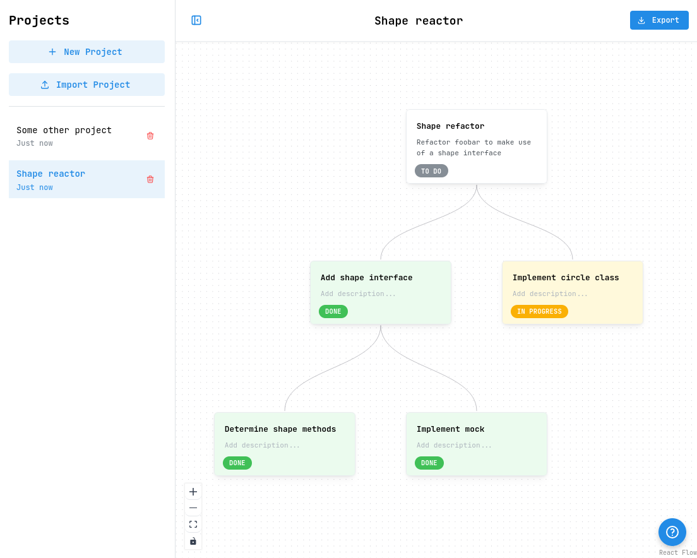

# Mikado Method Tool

A visual tool for planning and tracking code refactoring using the Mikado Method.

**[Try it now →](https://erichayter.github.io/mikado/)**

## What is this?

This app helps you break down complex refactoring tasks into manageable steps using the [Mikado Method](https://understandlegacycode.com/blog/the-mikado-method/). It provides a simple, visual interface for mapping out dependencies between refactoring tasks and tracking their progress.

I built this because I wanted a straightforward tool for applying the Mikado Method to my codebase refactors. Existing tools didn't quite fit what I needed, so I created this with:
- Clean, intuitive UI for visualizing task hierarchies
- Easy import/export to JSON for sharing and version control
- Browser-based storage using localStorage (no server required)

## How it works

The Mikado Method is a structured approach to refactoring:

1. **Start with your main goal** - Define what you want to achieve (e.g., "Refactor Shape Class Hierarchy")
2. **Set a timer** - Work on it for 15-30 minutes
3. **Did it work?** - If yes, mark it done and move on. If no, continue...
4. **Identify prerequisites** - Add the subtasks you discovered you need to complete first
5. **Revert your changes** - Go back to a working state
6. **Pick a subtask** - Work on one of the prerequisites instead
7. **Repeat** - Keep breaking down and completing tasks until your main goal is achievable

## Features

- Create multiple projects and switch between them
- Visual task hierarchy with automatic layout
- Color-coded status badges (red/yellow/green)
- Export projects as JSON files for backup or sharing
- Import projects from JSON
- All data stored locally in your browser
- Keyboard shortcuts for quick navigation
- Drag and pan canvas to explore large task trees

---

Built with the Mikado Method in mind for developers who refactor.
